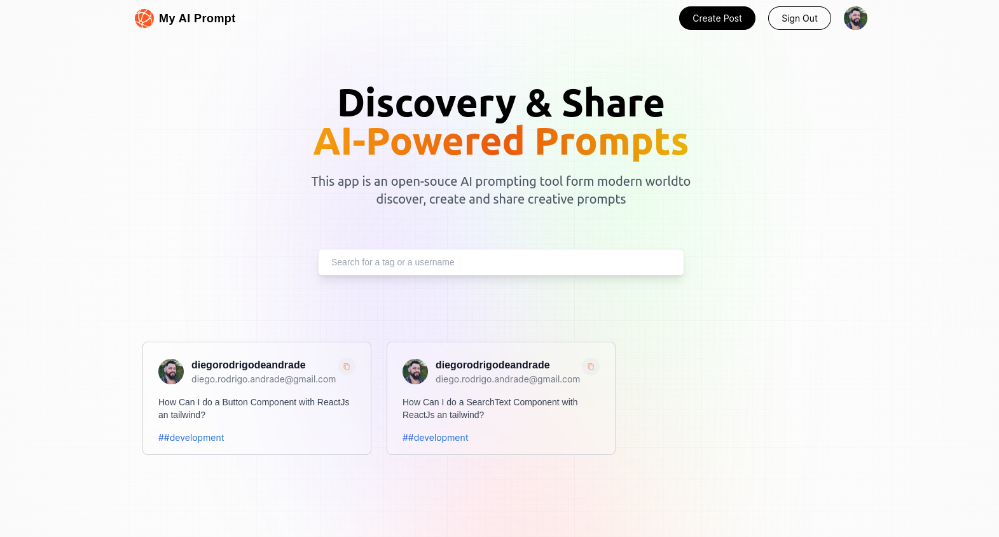

<h1 align="center">
    
</h1>
<h1 align="center">Fullstack NextJs App - AI Prompt</h1>
<p align="center">Discovery & Share
AI-Powered Prompts
This app is an open-souce AI prompting tool form modern worldto discover, create and share creative prompts
</p>

## Technologies
- [NextsJs](https://www.nextjs.org/) (v13 - App Router)
- [NextAuth](https://next-auth.js.org/) (with Google Provider Authentication)
- [MongoDB](https://www.mongodb.com/)
- [Mongoose](https://mongoosejs.com/docs/guide.html)
- [react-toastify](https://www.npmjs.com/package/react-toastify)
- [TailwindCSS](https://tailwindcss.com/)
- [react-native-toast-message](https://www.npmjs.com/package/react-native-toast-message)

## Instalation
To install the dependencies, clone the project on your computer an execute:
```bash

# Install dependencies
$ npm i

# Enter the environment variables in .env.local file
GITHUB_CLIENT_ID=""
GITHUB_CLIENT_SECRET=""
(These ids comes from your Google api account for you applications)
NEXTAUTH_SECRET=
(This ID comes from NextAuth key. Check the documentation on the link above)
MONGODB_URI=
(This URI comes from your cluster created for this application)

# Start application
$ npm run dev

# running on port 3000
```

## Frontend

</img>

Made with ♥ by Diego Andrade :wave: [Get in touch!](https://www.linkedin.com/in/diego-r-andrade/)

